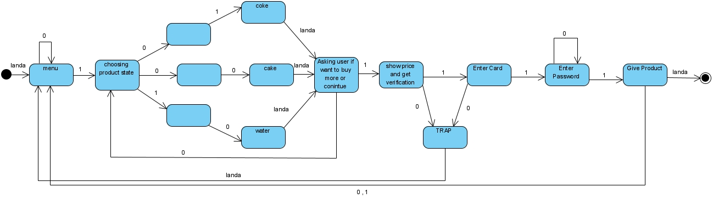

# FSM-VendingMachine
A simple vending machine made using FSM(Finite-state machine)

The state machine for the program is shown below:

The program follows the state machine steps and let the user buy from vending machine.

